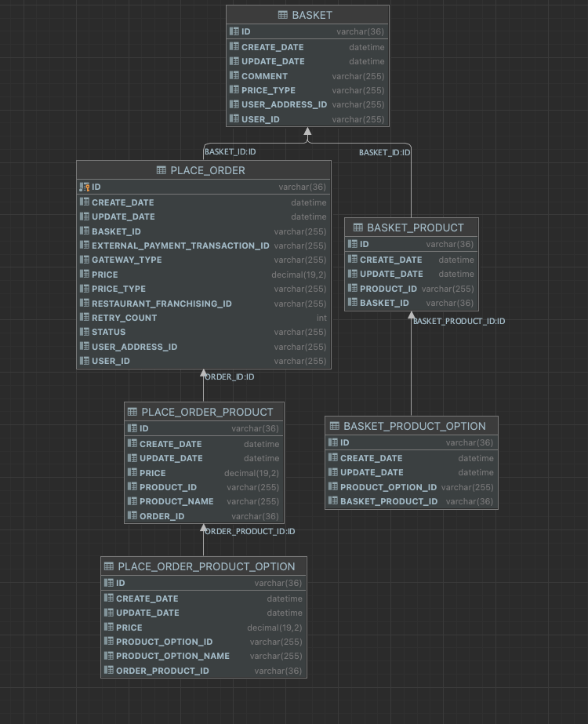
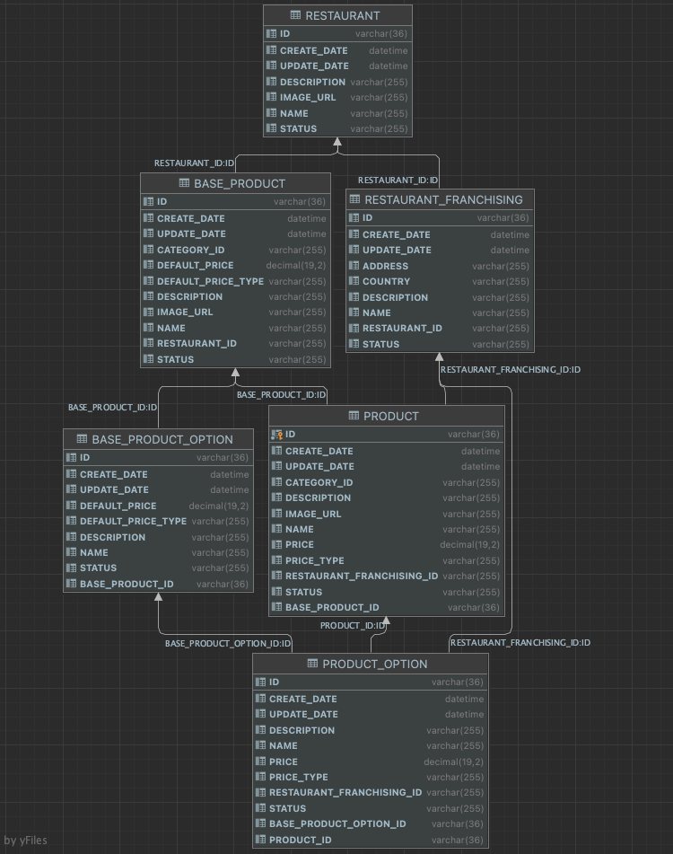

## FoodOrder Case project
Project Goal:

"Food Ordering System" that will be a fresh breeze in the industry. 
There is a need for many microservices for this purpose, 
but we will only focus on the "restaurant" and "order" microservices. 
All the endpoints that communicate over HTTP are Restful, and each microservice has its own database/schema.

Project written with java 17 + Spring Boot 2.6.6 Tech:
<b>

- Mysql
- Kafka (refund mechanism)
- Redis (basket locking)
- Flyway
- Docker (with Volumes)
- Scheduler
- Testcontainers
- Open Api
- FeignClient
  </b>

Project Architecture Contents:

- DDD with Hexagonal Architecture
- SAGA Pattern (order rollback)
- Outbox Pattern (order reconciliation)
- Factory pattern (payment methods, rule)

This project has 12 endpoints;

* Order Api

1. **PUT /v1/baskets/{basketId}/add-product** add product and product option to basket

2. **POST /v1/orders/place-order** to buy items in the basket

3. **GET /v1/orders/histories/{userId}?page={page}&size={size}** get orders history

* Restaurant Api

1. **Post /v1/restaurants** crate a new restaurant

2. **POST /v1/restaurants/{restaurantId}/franchisings** create new restaurant franchising

3. **GET /v1/restaurants/{restaurantId}** get restaurant by id with sub franchisings

4. **POST /v1/base-products** create new base product

5. **POST /v1/base-products/{baseProductId}/base-options** create new base product option

6. **GET /v1/products?uuids=** get Products with productIds

7. **POST /v1/products** create product

8. **POST /v1/products/{productId}/options** create product option

9. **GET /v1/products/{id}** get product by id

Key Words - Examples :

1. Base Product : Base product is a restaurant's products for exm. Starbucks's White Mocha
2. Base Product Option : Base product option is a restaurant's product's options for exm. Starbucks's White Mocha's
   extra shot
3. Restaurant : Restaurant is a base restaurant for exm. Starbucks
4. Restaurant Franchising : Restaurant Franchising is a restaurant's franchises for exm. Starbucks Moda Branch
5. Product : Product is a restaurant's franchising's products for exm. Starbucks Moda Branch's White Mocha (may be of
   different price)
6. Product Option : Product Option is a restaurant's franchising's product's options for exm. Starbucks Moda Branch's
   White Mocha's extra shot (maybe of different price)
7. Basket : Basket is a simple Basket, each user has a basket
8. Order : Order is the historical version of the Basket

For run project ;

Build : 

Firstly delete module base pom.xml and build. After delete module in module's pom.xml and build
domain,infra. After building all modules, re-add modules to poms and build all project

1. With Docker :
  - Compile project with Java 17
  - Run with Docker comments , go to project folder and run this commands:

    ```
    $ cd order-api
    $ docker build -t order-api-image . 
    $ cd ..
    $ cd restaurant-api
    $ docker build -t restaurant-api-image .
    $ cd .. 
    $ docker-compose -f docker-compose.yaml up -d
    ```
2. With IDE  :
  - Firstly you must be run mysql,kafka,zookeper and redis in docker
  - add your host file
    - 0.0.0.0 zookeeper
    - 0.0.0.0 food-order-kafka
    - 0.0.0.0 food-order-order-mysql
    - 0.0.0.0 food-order-restaurant-mysql
    - 0.0.0.0 food-order-redis
    - 0.0.0.0 restaurant-api
    - 0.0.0.0 order-api
  - Run mysql in docker-compose.yaml file and run java project

For usage project :

    1. First of all, crate a restaurant and franchising
    2. Create a Base product and option using restaurant ids
    3. Create a Product and option using base product, base product option and franchising ids
    4. Add product and option as you selected to basket (U can find auto generated basket id on DB)
    5. And Place Order with basketId,creadit card with some ids
    6. Check your order status with order history
    7. İf rollback failed due to integration or network problem dont forget project have a scheduler job for reconciliation


Project have Open Api you can test it in our browser by visiting http://localhost:8080/swagger-ui.html ,
http://localhost:8082/swagger-ui.html
and u can find postman collections in base folder.

***DATABASE***

Project has two databases :

   1. FOOD_ORDER_CASE_RESTAURANT
   2. FOOD_ORDER_CASE_ORDER
   
Database is Mysql in Docker with volume


**Database Schema**
 


